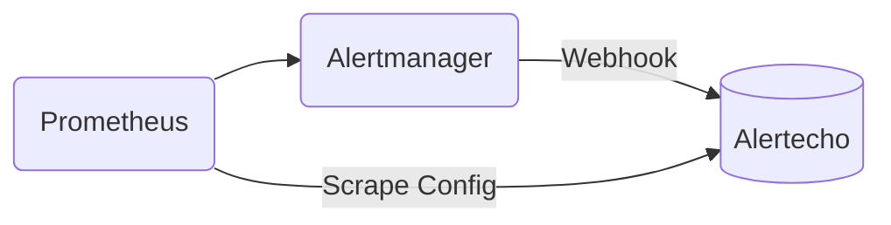
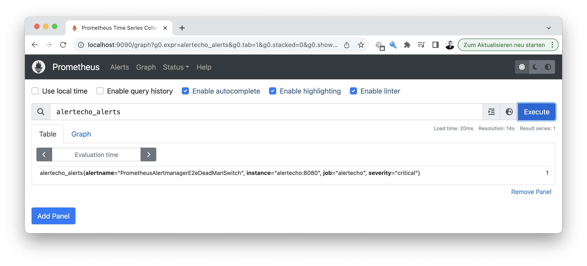

# 📣 Prometheus Alertecho

A echo service for your Prometheus alert history for
retrospective analysis.



[Prometheus alerts](https://prometheus.io/docs/prometheus/latest/configuration/alerting_rules/) are delivered
to Prometheus Alertecho via the [Prometheus Alertmanager](https://prometheus.io/docs/alerting/latest/alertmanager/).
Prometheus scrapes them via a scrape config and stores them
in the Prometheus data storage for in-detail analysis.




## 🏃‍♀️ Setup

A Docker image is available at both [Docker Hub](https://hub.docker.com/r/observabilitystack/prometheus-alertecho) and
GitHub Container Registry for both `arm64` and `x86` architectures.

```bash
docker run -p 9095:9095 \
    ghcr.io/observabilitystack/prometheus-alertecho
```

The `/alerts` endpoint accepts Prometheus Alertmanager Webhook messages
while the `/metrics` endpoint allows Prometheus to scrape stored alerts.

### 💃 Configure the Prometheus - Alertmanager - Alertecho ensemble

> 🗂️ The [`examples`](examples/) folder contains a working minimal setup

1. In your _Alertmanager_ configure Alertecho as a unfiltered receiver. This will forward all
firing alerts to Alertecho.

```yaml
route:
  receiver: alertecho
receivers:
  - name: alertecho
    webhook_configs:
      - send_resolved: true
        url: http://alertecho:9095/alerts
```

2. In your _Prometheus scrape configuration_ add a job to scrape firing and resolved
   alerts from Alertecho.

```yaml
- job_name: alertecho
  static_configs:
    - targets:
        - alertecho:9095
```

3. In your Prometheus you will now find `alertecho_alerts` metrics with all labels
   from the original firing alert. Use these for historical analysis of outages and
   alert escalation.

## 📦 Building locally

We use a Docker builder pattern and [graalvm-maven-builder](https://github.com/observabilitystack/graalvm-maven-builder) to build a native image.

```shell
docker build \
    -t observabilitystack/prometheus-alertecho .
```

## 📖 License

This image is licensed under [MIT License](LICENSE)
