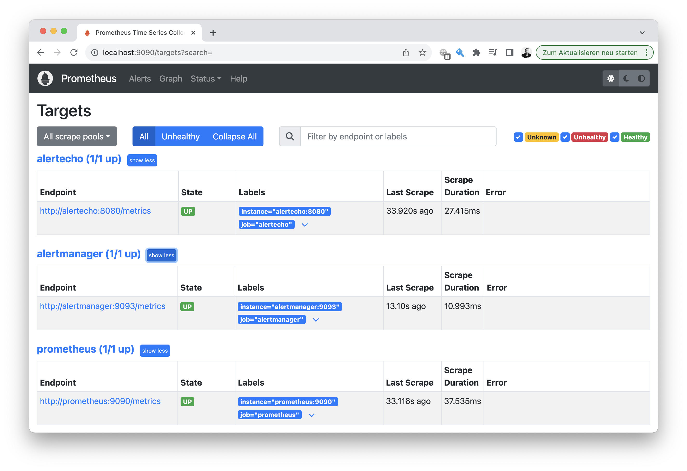
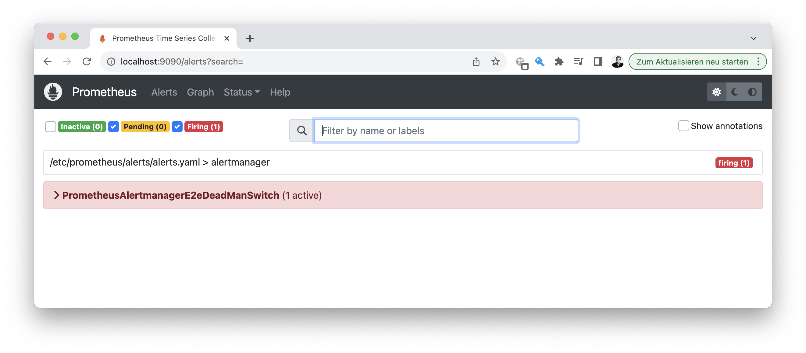
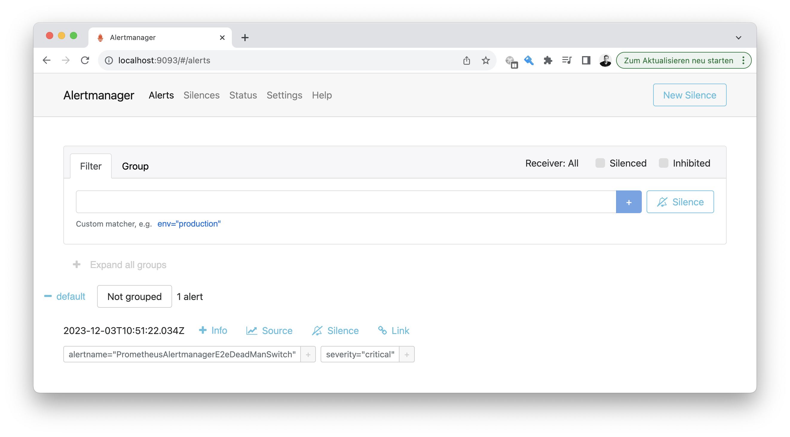

# 📣 Prometheus Alertecho example

This is a very minimalistic setup example of [Prometheus](https://prometheus.io/docs/prometheus/latest/configuration/configuration/),
[Prometheus Alertmanager](https://prometheus.io/docs/alerting/latest/alertmanager/) and Alertecho.

> You need Docker and Docker-Compose installes

To get started, clone this repo, change into the `examples` folder (this folder)
and launch the Docker Compose ensemble:

```bash
docker-compose up
```

You can browse the Prometheus UI at [localhost:9090](http://localhost:9090), the Alertmanager UI at [localhost:9093](http://localhost:9093) and the Alertecho Metrics at
[localhost:9095/metrics](http://localhost:9095/metrics)

## 🧐 In-depth details

...

### Prometheus




### Alertmanager



### Alertecho alert metrics


